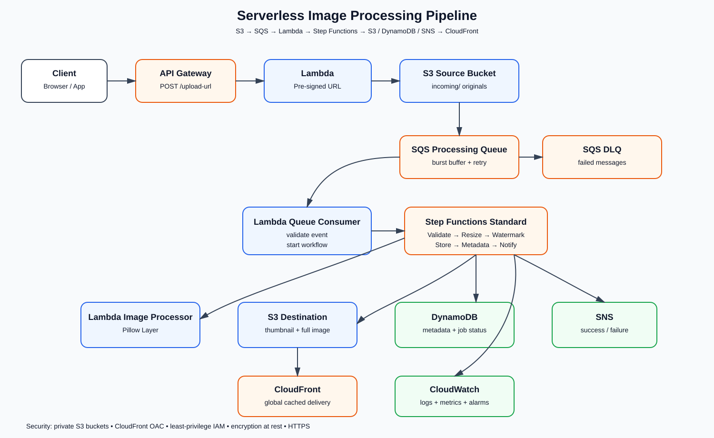

# Serverless Image Processing Pipeline with S3, SQS & Lambda

A serverless, event-driven image processing pipeline on AWS. Images are uploaded through a pre-signed S3 URL, queued through Amazon SQS for reliable decoupling, processed by AWS Step Functions and Lambda, stored in a destination S3 bucket, indexed in DynamoDB, and delivered globally through CloudFront. Amazon SNS reports completion or failure.

## 1. Project Overview

### Goal
Build a resilient image-processing platform that can accept bursts of uploads without coupling upload traffic directly to image-processing compute.

### Processing flow
1. The client requests a pre-signed upload URL from API Gateway + Lambda.
2. The client uploads the original image directly to the S3 source bucket.
3. S3 sends an object-created event to an SQS standard queue.
4. SQS buffers bursts and provides retry behavior. A dead-letter queue (DLQ) captures messages that repeatedly fail.
5. An SQS-triggered Lambda validates the event and starts a Step Functions Standard execution.
6. Step Functions orchestrates validation, resizing, watermarking, storage, metadata persistence, and notification.
7. Processed objects are stored in the S3 destination bucket.
8. DynamoDB stores image metadata and processing status.
9. SNS publishes completion/failure notifications.
10. CloudFront serves processed images globally from the destination bucket.

## 2. Architecture

The repository includes the architecture diagram at docs/architecture.svg.

### Main AWS services

| Service | Responsibility |
|---|---|
| Amazon S3 | Source uploads and processed image storage |
| Amazon API Gateway | Upload URL API |
| AWS Lambda | URL generation, queue consumption, and image-processing tasks |
| Amazon SQS | Durable decoupling and buffering |
| SQS DLQ | Captures messages after repeated processing failures |
| AWS Step Functions | Orchestrates the multi-step workflow |
| Amazon DynamoDB | Image metadata and status |
| Amazon SNS | Completion/failure notifications |
| Amazon CloudFront | Global delivery and caching |
| AWS KMS | Encryption where configured |
| Amazon CloudWatch | Logs, metrics, alarms, and operational visibility |

## 3. Why SQS is between S3 and Lambda

Direct S3-to-Lambda invocation can work for simple workloads, but this design intentionally uses SQS as a buffer.

Benefits:
- absorbs bursts of uploads
- separates upload availability from processing capacity
- provides retries
- supports a DLQ for poison messages
- allows Lambda concurrency to be controlled
- prevents temporary processing problems from blocking uploads

The queue consumer should have a visibility timeout greater than the expected Lambda processing time. The DLQ redrive policy should use a bounded retry count.

## 4. Step Functions workflow

~~~text
Validate Event
     |
     v
Resize Image
     |
     v
Apply Watermark
     |
     v
Store Processed Image
     |
     v
Write Metadata to DynamoDB
     |
     v
Publish SNS Success
~~~

Any unhandled processing failure transitions to a failure path that updates the image status and publishes an SNS failure event.

## 5. Storage design

### Source bucket
Stores original uploads under a prefix such as:

~~~text
incoming/{image-id}/original.jpg
~~~

### Destination bucket
Stores generated assets:

~~~text
processed/{image-id}/thumbnail.jpg
processed/{image-id}/full.jpg
~~~

The source and destination buckets are separated so processed objects cannot accidentally retrigger the source notification path.

### Lifecycle
Recommended lifecycle behavior:
- source originals: transition to an infrequent-access class after the retention threshold
- old originals: expire when business retention allows
- processed derivatives: retain according to delivery requirements
- incomplete multipart uploads: abort automatically after a short period

## 6. Security

- Keep both S3 buckets private.
- Use CloudFront Origin Access Control (OAC) for the destination bucket.
- Grant CloudFront only the required S3 read permission.
- Use least-privilege IAM roles for every Lambda and Step Functions task.
- Use short-lived pre-signed PUT URLs rather than exposing S3 write access.
- Encrypt data at rest where required.
- Use HTTPS for API Gateway and CloudFront.
- Never put AWS credentials in application code.
- Store application secrets in AWS Secrets Manager if introduced later.

## 7. Lambda image processing

The example processor in src/image_processor/app.py demonstrates downloading an S3 object, resizing while preserving aspect ratio, applying a text watermark, and uploading derivatives.

Pillow should be supplied through a Lambda Layer or container image built for the exact Lambda runtime and architecture.

## 8. Failure handling

### SQS
- Standard queue
- Visibility timeout greater than Lambda timeout
- Redrive policy to DLQ after a bounded number of receives

### Step Functions
- Retry transient Lambda failures with exponential backoff
- Catch terminal failures
- Update DynamoDB status
- Publish an SNS failure event

### Idempotency
S3 notifications can be delivered more than once. The workflow should use a deterministic image/job ID and make DynamoDB updates and destination writes idempotent.

## 9. DynamoDB data model

Table: ImageJobs

| Attribute | Purpose |
|---|---|
| imageId | Partition key |
| sourceKey | Original S3 object key |
| status | RECEIVED / PROCESSING / COMPLETED / FAILED |
| width | Original width |
| height | Original height |
| thumbnailKey | Generated thumbnail key |
| fullImageKey | Generated full image key |
| uploadedAt | Upload timestamp |
| processedAt | Completion timestamp |
| error | Failure information when applicable |

## 10. CloudFront

CloudFront uses the destination S3 bucket as its origin.

Recommended cache behavior:
- Viewer protocol: redirect HTTP to HTTPS
- Methods: GET/HEAD for image delivery
- Compression: enabled where useful
- Cache based primarily on the object path
- S3 origin protected with Origin Access Control

Clients should use CloudFront URLs rather than direct S3 URLs for processed assets.

## 11. Upload API

Example endpoint:

~~~text
POST /upload-url
~~~

Example request:

~~~json
{
  "fileName": "photo.jpg",
  "contentType": "image/jpeg"
}
~~~

The API returns a short-lived pre-signed S3 URL and the object key. The browser then uploads directly to S3, avoiding large image bodies through API Gateway or Lambda.

## 12. Repository structure

~~~text
.
├── README.md
├── docs/
│   ├── architecture.svg
│   └── architecture-notes.md
└── src/
    └── image_processor/
        └── app.py
~~~

## 13. Deployment notes

This repository is a reference implementation/documentation project. Before deployment, create the AWS resources with AWS SAM, AWS CDK, or Terraform and supply environment-specific values such as bucket names, CloudFront configuration, DynamoDB table name, and SNS topic ARN.

Do not commit AWS access keys, secrets, private keys, or generated credentials.

## 14. Cost considerations

The architecture is serverless and usage-based:
- S3: storage and requests
- SQS: requests
- Lambda: invocations and compute duration
- Step Functions: state transitions
- DynamoDB: capacity and storage
- CloudFront: requests and data transfer
- SNS: publishing/delivery

Remove unused resources after testing to avoid ongoing charges.

## 15. Learning outcomes

This project demonstrates:
- event-driven architecture using S3 and SQS
- resilient asynchronous processing
- SQS retry and DLQ patterns
- Lambda image processing and dependency packaging
- Step Functions orchestration
- S3 lifecycle management
- DynamoDB metadata persistence
- SNS notifications
- CloudFront global content delivery
- least-privilege IAM and private S3 origins

## 16. Validation checklist

- [ ] Source S3 bucket is private
- [ ] S3 event notification targets SQS
- [ ] SQS has a DLQ and redrive policy
- [ ] SQS-triggered Lambda starts Step Functions
- [ ] Step Functions validates and processes the image
- [ ] Pillow is provided through a compatible Lambda Layer/container
- [ ] Destination bucket is separate from the source bucket
- [ ] DynamoDB records processing status
- [ ] SNS reports success/failure
- [ ] CloudFront uses OAC for the destination bucket
- [ ] IAM policies follow least privilege
- [ ] Lifecycle rules are configured
- [ ] No AWS secrets are committed to GitHub

## 17. Submission deliverables

1. Solution Architecture Diagram: included in this README and stored at docs/architecture.svg.
2. Public GitHub Repository: contains the README, architecture diagram, architecture notes, and Lambda example.
